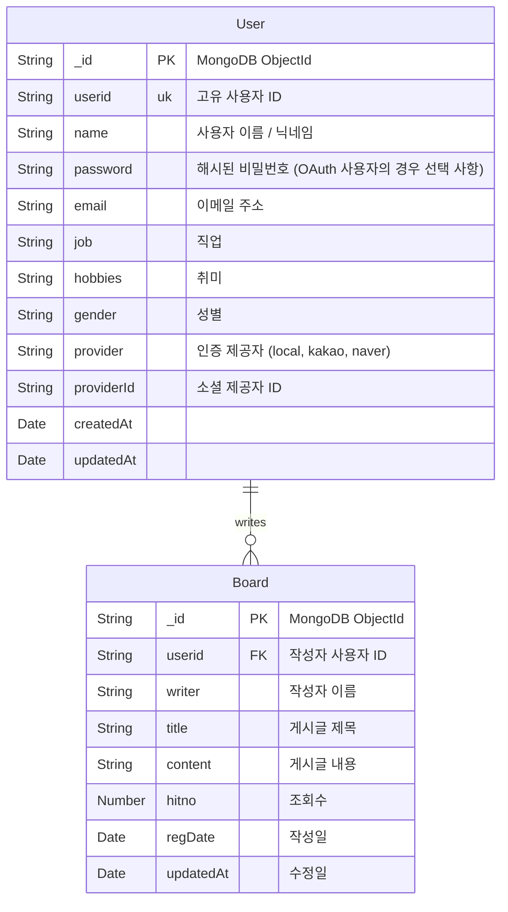
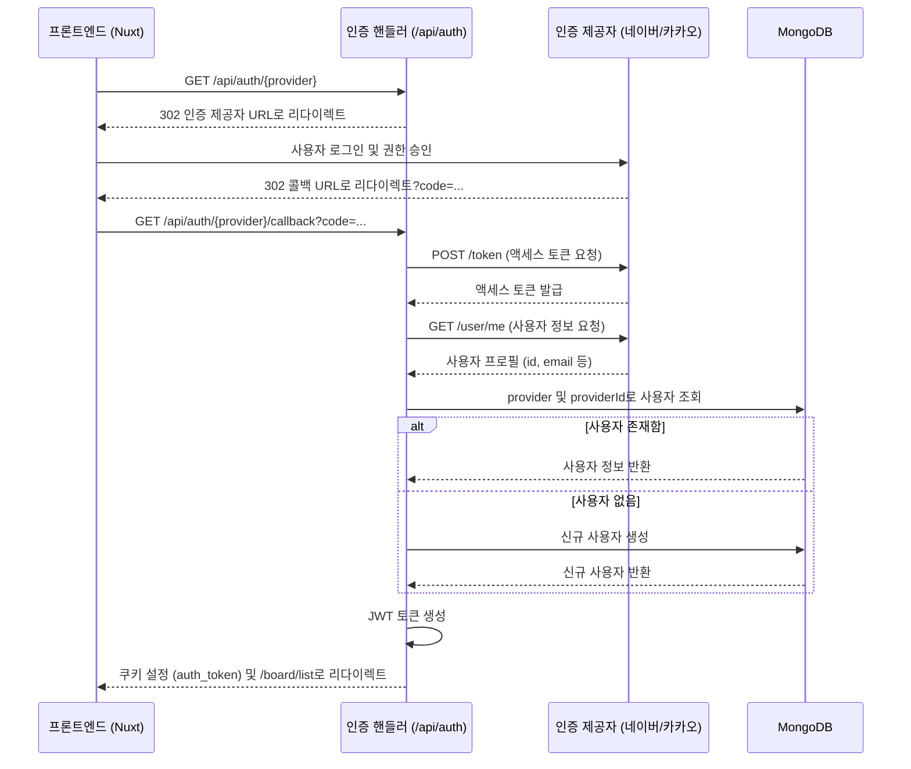

# Nuxt 3 게시판 프로젝트

이 프로젝트는 **Nuxt 3**와 **MongoDB**로 구축된 **게시판 애플리케이션**입니다. 서버 사이드 렌더링(SSR), JWT 기반 인증, 그리고 OAuth2 소셜 로그인(카카오, 네이버) 기능을 갖춘 풀스택 애플리케이션입니다.

## 🛠 기술 스택

- **프레임워크**: [Nuxt 3](https://nuxt.com/) (Vue 3, Nitro)
- **데이터베이스**: [MongoDB](https://www.mongodb.com/) (Mongoose 사용)
- **인증**: JWT (JSON Web Token), OAuth2 (카카오, 네이버)
- **상태 관리**: Nuxt `useState` / `useCookie`
- **스타일링**: Scoped CSS

## 📊 ERD (개체 관계 다이어그램)



## 🔄 OAuth2 로그인 시퀀스 다이어그램

다음 다이어그램은 소셜 로그인(카카오/네이버)의 인증 흐름을 설명합니다.



## 📝 테이블 (컬렉션) 명세서

### 1. 사용자 컬렉션 (`users`)

| 필드명 | 타입 | 필수 여부 | 고유 여부 | 설명 |
| :--- | :--- | :--- | :--- | :--- |
| `_id` | ObjectId | 예 | 예 | MongoDB 문서 ID |
| `userid` | String | 예 | 예 | 사용자 고유 식별자 (예: `user1`, `kakao_12345`) |
| `name` | String | 예 | 아니오 | 사용자 표시 이름 또는 닉네임 |
| `password` | String | 아니오* | 아니오 | 해시된 비밀번호. `local` 제공자인 경우에만 필수. |
| `email` | String | 예 | 아니오 | 사용자 이메일 주소 |
| `job` | String | 아니오 | 아니오 | 사용자 직업 |
| `hobbies` | String | 아니오 | 아니오 | 사용자 취미 |
| `gender` | String | 아니오 | 아니오 | 사용자 성별 |
| `provider` | String | 예 | 아니오 | 로그인 제공자: `local`, `kakao`, `naver` (기본값: `local`) |
| `providerId` | String | 아니오 | 아니오 | 소셜 제공자의 고유 ID |
| `createdAt` | Date | 예 | 아니오 | 생성 일시 |
| `updatedAt` | Date | 예 | 아니오 | 마지막 수정 일시 |

### 2. 게시판 컬렉션 (`boards`)

| 필드명 | 타입 | 필수 여부 | 설명 |
| :--- | :--- | :--- | :--- |
| `_id` | ObjectId | 예 | MongoDB 문서 ID |
| `userid` | String | 예 | 작성자의 사용자 ID |
| `writer` | String | 예 | 작성자의 이름 |
| `title` | String | 예 | 게시글 제목 |
| `content` | String | 예 | 게시글 내용 |
| `hitno` | Number | 아니오 | 조회수 (기본값: 0) |
| `regDate` | Date | 예 | 작성 일시 (`createdAt` 별칭) |
| `updatedAt` | Date | 예 | 마지막 수정 일시 |

## 🚀 설치 및 실행 가이드

### 사전 요구사항
- Node.js (v18 이상)
- MongoDB (로컬 또는 Atlas)

### 1. 의존성 설치

```bash
npm install
```

### 2. 환경 변수 설정 (.env)

루트 디렉토리에 `.env` 파일을 생성하고 다음 내용을 설정하세요:

```ini
# 데이터베이스
MONGODB_URI=mongodb://localhost:27017/boarddev

# 인증 시크릿 키
JWT_SECRET=your_jwt_secret_key

# OAuth 제공자 설정
# 카카오
KAKAO_CLIENT_ID=your_kakao_client_id
KAKAO_CLIENT_SECRET=your_kakao_client_secret

# 네이버
NAVER_CLIENT_ID=your_naver_client_id
NAVER_CLIENT_SECRET=your_naver_client_secret

# 퍼블릭 URL (콜백용)
BASE_URL=http://localhost:3000
```

### 3. 개발 서버 실행

```bash
npm run dev
```

서버가 `http://localhost:3000`에서 시작됩니다.
