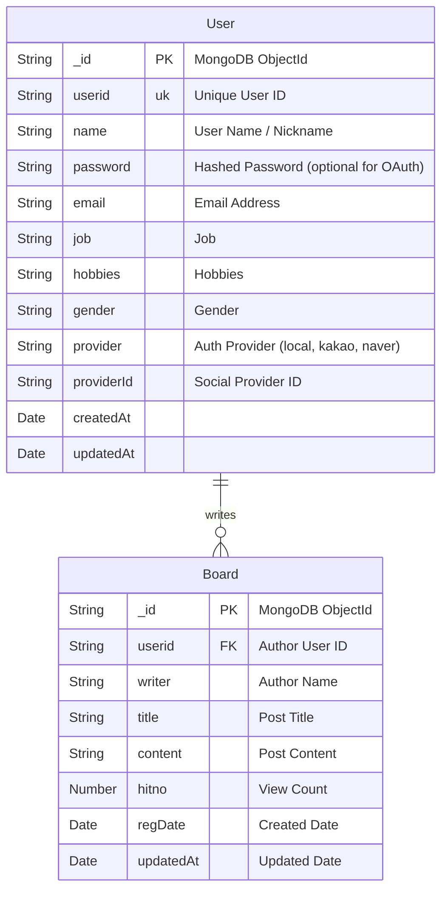
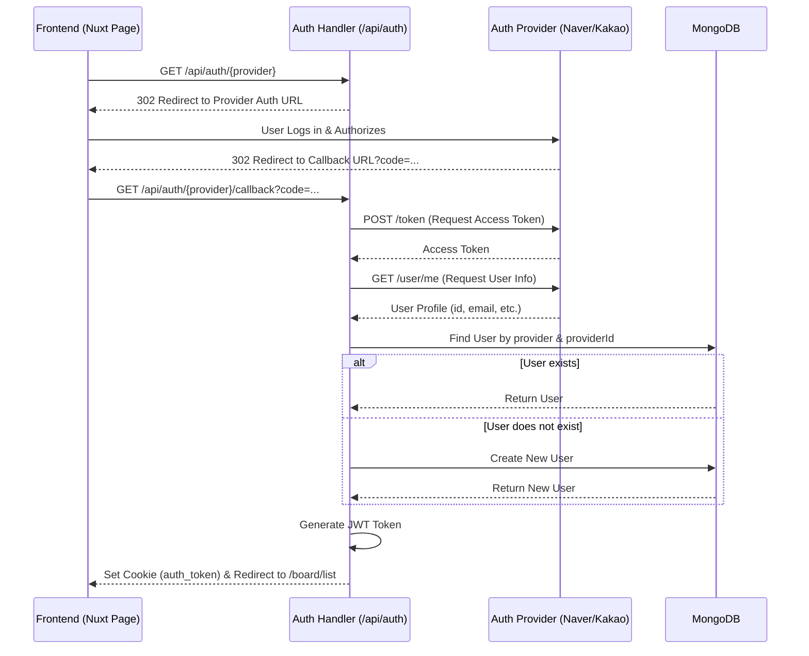

# Nuxt 3 Board Project

This is a **Board Application** built with **Nuxt 3** and **MongoDB**. It features full-stack capability with server-side rendering (SSR), JWT-based authentication, and OAuth2 social login integration (Kakao, Naver).

## 🛠 Tech Stack

- **Framework**: [Nuxt 3](https://nuxt.com/) (Vue 3, Nitro)
- **Database**: [MongoDB](https://www.mongodb.com/) (using Mongoose)
- **Authentication**: JWT (JSON Web Token), OAuth2 (Kakao, Naver)
- **State Management**: Nuxt `useState` / `useCookie`
- **Styling**: Scoped CSS

## 📊 ERD (Entity Relationship Diagram)



## 🔄 OAuth2 Login Sequence Diagram

The following diagram illustrates the authentication flow for Social Login (Kakao/Naver).



## 📝 Table (Collection) Specifications

### 1. Users Collection (`users`)

| Field | Type | Required | Unique | Description |
| :--- | :--- | :--- | :--- | :--- |
| `_id` | ObjectId | Yes | Yes | MongoDB Document ID |
| `userid` | String | Yes | Yes | User's unique identifier (e.g., `user1`, `kakao_12345`) |
| `name` | String | Yes | No | User's display name or nickname |
| `password` | String | No* | No | Hashed password. Required only for `local` provider. |
| `email` | String | Yes | No | User's email address |
| `job` | String | No | No | User's job |
| `hobbies` | String | No | No | User's hobbies |
| `gender` | String | No | No | User's gender |
| `provider` | String | Yes | No | Login provider: `local`, `kakao`, `naver` (Default: `local`) |
| `providerId` | String | No | No | Unique ID from the social provider |
| `createdAt` | Date | Yes | No | Creation timestamp |
| `updatedAt` | Date | Yes | No | Last update timestamp |

### 2. Boards Collection (`boards`)

| Field | Type | Required | Description |
| :--- | :--- | :--- | :--- |
| `_id` | ObjectId | Yes | MongoDB Document ID |
| `userid` | String | Yes | ID of the user who wrote the post |
| `writer` | String | Yes | Name of the user who wrote the post |
| `title` | String | Yes | Title of the post |
| `content` | String | Yes | Content of the post |
| `hitno` | Number | No | View count (Default: 0) |
| `regDate` | Date | Yes | Creation timestamp (`createdAt` alias) |
| `updatedAt` | Date | Yes | Last update timestamp |

## 🚀 Setup & Run

### Prerequisites
- Node.js (v18+)
- MongoDB (Local or Atlas)

### 1. Install Dependencies

```bash
npm install
```

### 2. Environment Configuration (.env)

Create a `.env` file in the root directory:

```ini
# Database
MONGODB_URI=mongodb://localhost:27017/boarddev

# Auth Secret
JWT_SECRET=your_jwt_secret_key

# OAuth Providers
# Kakao
KAKAO_CLIENT_ID=your_kakao_client_id
KAKAO_CLIENT_SECRET=your_kakao_client_secret

# Naver
NAVER_CLIENT_ID=your_naver_client_id
NAVER_CLIENT_SECRET=your_naver_client_secret

# Public URL (for callbacks)
BASE_URL=http://localhost:3000
```

### 3. Run Development Server

```bash
npm run dev
```

Server will start at `http://localhost:3000`.
